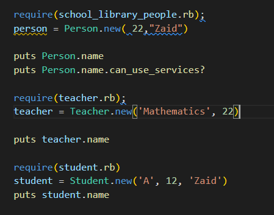

# OOP-school-library
Imagine that you are the librarian of OOP University, and you need a tool to record what books are in the library and who borrows them. The app that you will create will allow a you to:  Add new students or teachers. Add new books. Save records of who borrowed a given book and when.

- Use [school_library_people.rb](./school_library_people.rb) to add Person instance.

- Use [student.rb](./student.rb) to add Student instance.

- Use [teacher.rb](./teacher.rb) to add Teacher instance.

# Set up
make sure that you have ruby downloaded on  your computer [install ruby](https://www.ruby-lang.org/en/documentation/installation/)
Install

## Usage
- use the methods in student.rb to add student  by define an instance of Student  class.
- use the methods in teacher.rb to add teacher  by define an instance of Teacher  class.
- use the methods in school_library_people.rb to add person  by define an instance of Person  class.

# Run tests

try this code to test the methods

## Authors

👤 **Meqdam Al-qudah**

- [GitHub](https://github.com/MeqdamAlqudah)
- [Twitter](https://twitter.com/MeqdamQudah)
- [LinkedIn](www.linkedin.com/in/meqdam-al-qudah-7514a21b5)

## 🤝 Contributing

Contributions, issues, and feature requests are welcome!

Feel free to check the [issues page](../../issues/).

## Show your support

Give a ⭐️ if you like this project!

## Acknowledgments

- Hat tip to anyone whose code was used
- Inspiration
- etc

## 📝 License

This project is [MIT](./MIT.md) licensed.